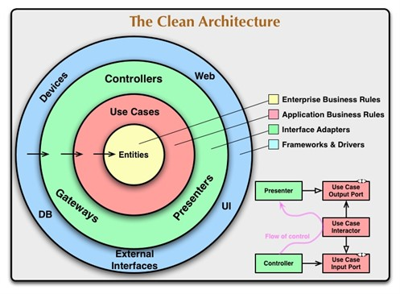

# Exercice Listo

## Que vais-je coder ?
Dans le domaine de la paie, la période mensuelle, commençant le premier jour du mois et se terminant le premier jour du mois suivant, est le format le plus fréquemment utilisé, coïncidant avec la fréquence d'édition des bulletins de paie. Cependant, il existe d'autres types de périodes, comme les périodes d'absence pour les congés. 

Il est ainsi requis une fonction informatique capable de déterminer si la période de congés d'un employé se situe en totalité ou partiellement dans une période mensuelle. En cas d'empiètement de la période de congés sur plusieurs périodes mensuelles, la fonction devra diviser la période de congés en segments correspondant à chaque période mensuelle. Il est également exigé que cette application opère de façon autonome et puisse être intégrée à d'autres systèmes existants.

## Quelle est ma compréhension de l'énoncé ?
En me basant sur la méthode [BDD (Behavior Driven Development)](https://github.com/b-fontaine/listo-exam-conges#bdd-behavior-driven-development), je vais fournir un scénario de test basé sur un example mapping issu de mon imagination.
``` gherkin
Feature: Congés
  Relation entre congés et périodes mensuelles

  Scenario Outline: Nouvelle période mensuelle après le retrait des congés
    Given Le salarié a posé un congé du "<debut_conge>" au "<fin_conge>"
    When Je mets à jour la période nommée "<periode_mensuelle>"
    Then La période mensuelle commence le "<debut_mensuel>" et finit le "<fin_mensuel>"

    Examples:
      | debut_conge | fin_conge  | periode_mensuelle | debut_mensuel | fin_mensuel |
      | 2018-01-01  | 2018-01-05 | 2018-01           | 2018-01-06    | 2018-01-31  |
      | 2018-01-01  | 2018-01-31 | 2018-02           | 2018-02-01    | 2018-02-28  |
      | 2018-02-01  | 2018-02-11 | 2018-02           | 2018-02-12    | 2018-02-28  |
      | 2018-01-15  | 2018-02-11 | 2018-01           | 2018-01-01    | 2018-01-14  |
      | 2018-01-15  | 2018-02-11 | 2018-02           | 2018-02-12    | 2018-02-28  |
``` 

## Tester l'application
J'ai choisi Flutter et Dart pour réaliser cet exercice et j'ai séparé mon code en deux projets :
- conges_domain : package flutter (réutilisable) qui contient le code métier
- conges_ui : interface graphique qui utilise `conges_domain`, sert à l'interaction utilisateur

### Vérifier le code sur son poste
Avant tout, il vous faudra avoir Flutter installé sur votre poste. Clonez le repository, allez dans les répertoires `conges_domain` et `conges_ui` pour exécuter la commande 
``` shell
# flutter pub get
```

puis 
``` shell
# flutter test --coverage
```

Vous verrez, par vous même, le résultat des tests. Il est possible de vérifier la couverture de code via les fichiers `lcov.info` générés et le site [LCOV Viewer](https://lcov-viewer.netlify.app/).

Pour l'interface graphique, vous pouvez l'afficher sur votre poste au format web via la commande
``` shell
flutter run -d chrome
``` 
L'application reste, bien sur, accessible sur les autres plateformes depuis Android Studio ou VS Code.

## Tester l'application directement en ligne
Vous pourrez aussi tester l'application directement sur [un site dédié](https://exercice-listo.benoitfontaine.fr)


## Mes pratiques

Pour une qualité et une lisibilité optimale du code, pour un code réellement adapté au besoin et, enfin, pour un code avec une quantité minimale de bug/vulnérabilité, et ce, quelque soit la technologie, il nous faut des outils techniques mais aussi méthodologiques.

Pour la technique, l'indispensable et le minimum à avoir sont :

- Un IDE (VSCode, Visual Studio, Android Studio, etc.)
- Un linter 
- Un analyseur statique de code (Sonarqube, etc.)
- Un language ou superset typé (ici, Dart)

Pour la méthodologie, vous trouverez tout ce qu'il ci-dessous.

### TDD (Test Driven Development)

Le TDD (Développement piloté par les tests en français) est une méthode de développement qui consiste à réaliser les tests avant d'écrire le code de production.

Le principe est simple :

1. On écrit un test qui correspond au besoin
2. On vérifie qu'il échoue (si ce n'est pas le cas, c'est que le test doit être revu)
3. On implémente du code de production jusqu'à ce que le test passe au vert
4. On refactorise en faisant attention de garder tous ses tests au vert
5. On passe au test suivant

Dans le cas d'une résolution de bug, le traitement est sensiblement le même :

1. On écrit deux tests : une qui reproduit le bug (vert) et un qui correspond au comportement attendu (rouge)
2. On implémente du code de production qui inverse le résultat des deux tests
3. On supprime le test qui reproduit le bug
4. On refactorise en faisant attention de garder tous ses tests au vert
5. On passe au bug suivant

#### De l'intérêt des mocks

Mocker un élément de son code est un couplage fort entre le test et la modélisation, ce qui augmente drastiquement la compléxité et la maintenabilité des tests. Multiplier les mocks force votre code de production à être "testable", pas dans le bon terme mais celui qui érode le code et le rend moins lisible.

Sur un projet front web (Javascript), le seul mock réellement indispensable est celui qui communique avec l'API (le fetch ou le getJson pour RxJS)

Il existe un très bon article (en anglais) sur le sujet: [Mocking is a code smell](https://goo.gl/7VXZAS)

### BDD (Behavior Driven Development)

Le BDD (développement piloté par les comportements) reste un développement piloté par les tests mais ces tests sont des tests de comportement.

En gros, nous définissons un comportement attendu avec des exemples concrets et nous nous en servons comme base pour réaliser nos tests qui piloteront nos développements.

L'avantage de cette pratique, face aux tests unitaires, est l'utilisation du language [Gherkin](https://docs.cucumber.io/gherkin/reference/). Il permet de rendre les tests compréhensibles dans un non-spécialiste du développement (un PO, un client, etc.). Il peut ainsi, popentiellement, aller directement chercher dans le code et comprendre le comportement de l'application.

Pour plus d'informations sur le BDD, je vous conseille le site [cucumber.io](https://docs.cucumber.io/bdd/)

### SOLID

SOLID est un ensemble de principes qui répond à une problématique d'évolutivité du code source. Ils sont dans le livre `Agile Software Development, Pinciples, Patterns and Practices` de Robert C. Martin.

#### Single responsibility principle

Comme son nom l’indique, ce principe signifie qu’une classe ne doit posséder qu’une et une seule responsabilité.

#### Open close principle

Les classes et les méthodes doivent être ouvertes à l'extension mais fermées à la modification.

#### Liskov principle

"[...]La notion de sous-type telle que définie par Liskov et Wing est fondée sur la notion de substituabilité : si `S` est un sous-type de `T`, alors tout objet de type `T` peut être remplacé par un objet de type `S` sans altérer les propriétés désirables du programme concerné.

Le principe de Liskov impose des restrictions sur les signatures sur la définition des sous-types :

- Contravariance des arguments de méthode dans le sous-type.
- Covariance du type de retour dans le sous-type.
- Aucune nouvelle exception ne doit être générée par la méthode du sous-type, sauf si celles-ci sont elles-mêmes des sous-types des exceptions levées par la méthode du supertype.
- On définit également un certain nombre de conditions comportementales (voir la section Conception par contrat).(...)", [Wikipedia](https://fr.wikipedia.org/wiki/Principe_de_substitution_de_Liskov)

#### Interface segregation principle

L'objectif est d'utiliser les interfaces pour définir des contrats qui répondent à un besoin fonctionnel pour créer une abstraction et réduire le couplage.

**ATTENTION**

> L'utilisation systèmatique des interfaces pour chaque classe est un anti-pattern.

> Pensez à faire preuve de bon sens et de pragmatisme !

#### Dependency inversion principle

Ce principe consiste à rendre indépendant les modules de haut niveau de eux de bas niveau en inversant ces relations.

En gros :

- Les modules de haut niveau et les modules de bas niveau dépendent d'abstractions pour casser le lien de dépendance haut vers bas.
- Les abstractions ne doivent pas dépendre des détails. Les détails doivent dépendre des abstractions.

### Clean Code, Refactoring, Code Review

Ces termes résumes 3 principes de base du développeur :

- Rendre le code dans un meilleur état que celui dans lequel on l'a trouvé.
- L'état de l'art évolue et la perfection n'existe pas, il faut donc toujours retravailler son code
- Tout code rédigé ne peut être intégré s'il n'a pas été revu par vos pairs

Pour les code review, il existe deux outils :

1. **Revue de code :** moment passé entre développeurs pour trouver un maximum de bug, vulnérabilité ou code smell.
2. **Pull request :** même principe que la revue de code mais de façon asynchrone.

#### Le Domain Driven Design

Le Domain Driven Design (DDD, terme inventé par Eric Evans dans son livre du même titre) est une approche du développement logiciel pour des besoins complexes en connectant l' implémentation à un modèle évolutif.

DDD est basé sur deux principes :

- Toute conception métier complexe doit se baser sur un modèle de domaine.
- Se focaliser en premier sur le cœur de métier et sa logique au lieu des contraintes techniques.

Le DDD intervient sur des projets où les concepts métiers sont difficiles à comprendre et il est assez difficile à apréhender. Ainsi, nous ferons preuve de pragmatisme : l'objectif est de regrouper le code source de façon à ce qu'un product owner ou un client puisse s'y retrouver.

Nous aurons ici une approche hybride entre le TDD, le BDD et le DDD :

- Tout mon code sera testé mais la couverture sera partagée entre tests unitaires et tests de comportement
- Tous mes tests serons automatisés et piloteront mes développements et mon design
- L'approche sera orientée métier exclusivement, la technique (ou technologie) ne sera abordée que comme solution à un problème fonctionnel
- Les scenarios Gherkin seront co-écris entre le développeur, le testeur et le spécialiste métier
- L'avancement du projet se fera de façon itérative priorisé par la valeur business.


#### Clean Architecture

La Clean Architecture vise à réduire les dépendances de votre logique métier avec les services que vous consommez (API, Base de données, Framework, Librairies tierces), pour maintenir une application stable au cours de ses évolutions, de ses tests mais également lors de changements ou mises à jour des ressources externes.



Lors de l’implémentation de cette architecture il existe des règles, ayant toutes pour maître-mot « **l’indépendance** ».

La logique implémentée doit :

- Être **indépendante des frameworks** : les frameworks et librairies doivent être des outils, sans pour autant vous contraindre.
- Être **testable** indépendamment : les tests doivent pouvoir être réalisés sans éléments externes (interface utilisateur, base de données ...)
- Être **indépendante de l’interface utilisateur** : l’interface utilisateur doit pouvoir changer de forme (console, interface web ...)
- Être **indépendante de la base de données** : il doit être possible de changer de SGBD.
- Être **indépendante de tout service ou système externe** : en résumé elle ne doit pas avoir conscience de ce qui l’entoure.

De même que pour nos pratique, nous en aurons une approche pragmatique et progressive.